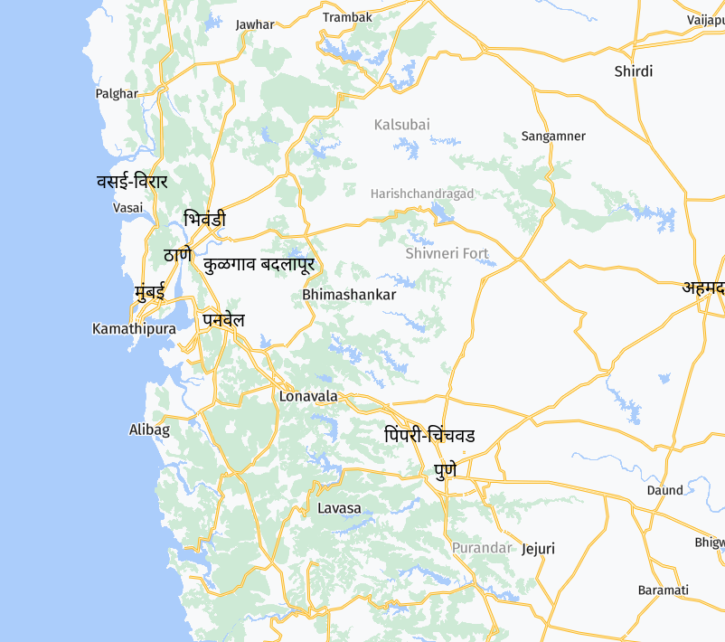

# MapLibre Canvas Labels

Proof-of-concept to render Hindi text labels in a `canvas` and copying the resulting image to a MapLibre map.

Quite slow to load, a bit an ugly solution producing many console errors, but the result still looks OK I find...

## Demo

## Languages

  * Hindi: https://wipfli.github.io/maplibre-canvas-labels#lanugage=hi
  * Tegulu: https://wipfli.github.io/maplibre-canvas-labels#language=te
  * Bengali: https://wipfli.github.io/maplibre-canvas-labels#language=bn
  * Gujarati: https://wipfli.github.io/maplibre-canvas-labels#language=gu
  * Malayalam: https://wipfli.github.io/maplibre-canvas-labels#language=ml
  * Punjabi: https://wipfli.github.io/maplibre-canvas-labels#language=pa
  * Marathi: https://wipfli.github.io/maplibre-canvas-labels#language=mr
  * Urdu: https://wipfli.github.io/maplibre-canvas-labels#language=ur
  * Persian: https://wipfli.github.io/maplibre-canvas-labels#language=fa
  * Arabic: https://wipfli.github.io/maplibre-canvas-labels#language=ar
  * Any other that is in OpenStreetMap... https://wiki.openstreetmap.org/wiki/Multilingual_names

## Try out locally

Map tiles from swiss-map.cc have cors for `localhost:3000`, so if you want to try this out locally, serve `index.html` at port 3000 for example with:

`npx serve .`

## Base Map Style

https://github.com/wipfli/swiss-map
